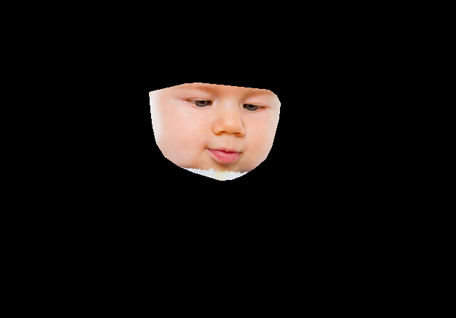
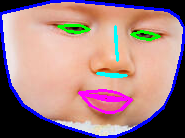
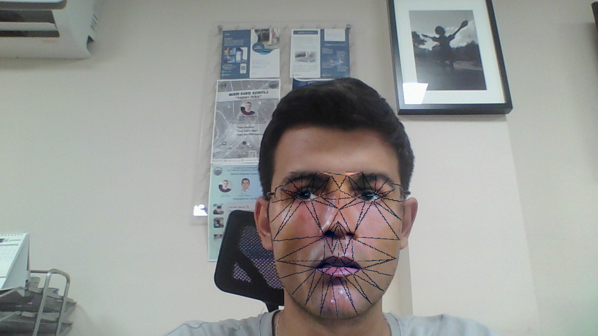

# Face Masking

Face detection, landmark extraction, masking, and swapping using dlib's 68-point facial landmark model and OpenCV.

## Notebooks

| File | Description |
|------|-------------|
| `face_cutting.ipynb` | Detect faces, extract 68 landmarks, create convex hull masks, and cut face regions from images |
| `face_cutting_babies.ipynb_` | Same face cutting pipeline applied to baby photos |
| `face_swapping.ipynb_` | Full face swapping — extracts landmarks from two faces, triangulates with Delaunay, warps, and blends seamlessly |

## How It Works

1. **Face Detection** — dlib's frontal face detector locates faces in the image
2. **Landmark Extraction** — 68 facial landmarks are predicted using `shape_predictor_68_face_landmarks.dat`
3. **Masking** — A convex hull is created from the landmark points, generating a binary mask
4. **Face Cutting** — The mask is applied to isolate the face region from the original image
5. **Face Swapping** — Delaunay triangulation warps one face onto another, followed by seamless cloning

## Results

### Face Cutting — Landmark Detection & Masking

### Face Cutting — Extracted Face Region

### Face Swapping — Result

## Tech Stack

- **Face Detection**: dlib (frontal face detector + 68-point landmark predictor)
- **Image Processing**: OpenCV (convex hull, bitwise ops, seamless clone)
- **Triangulation**: Delaunay triangulation for face warping
- **Platform**: Google Colab
